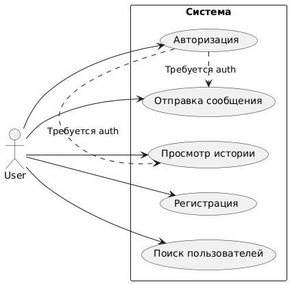
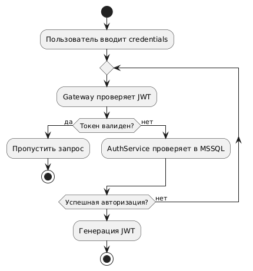
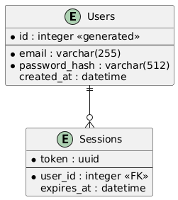
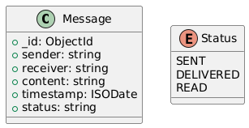

# DB_Microservices

## Микросервисная архитектура с:

    Изолированными БД (MSSQL для auth, MongoDB для чатов)

    Асинхронной коммуникацией через RabbitMQ

    Единой точкой входа (Gateway)

## Технологический стек

 **Gateway: TypeScript, NestJs, JWT**

 **Auth Servic: TypeScript, NestJs, JWT, MSSQL**

 **Chat Service: TypeScript, NestJs, MongoDB**

 **Инфраструктура: Docker, Prometheus, Grafana, RabbitMQ**

### Архитектурная диаграмма (Deployment Diagram)

  

## Use Case Diagram

  

## Диаграмма активности (Авторизация)

  

## Метрики

### ER-диаграмма MSSQL (Auth)

  

### Схема MongoDB (Chat)

  

## Автор

Программа была разработана студентом третьего курса Печёнкиным Артуром в рамках курса по дисциплине: "Технологии баз данных".

Контактная информация:

- Артур [@machinee](https://github.com/freeeakn)
